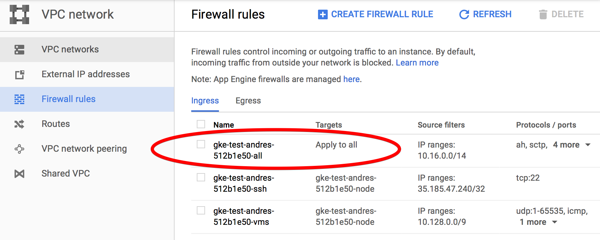
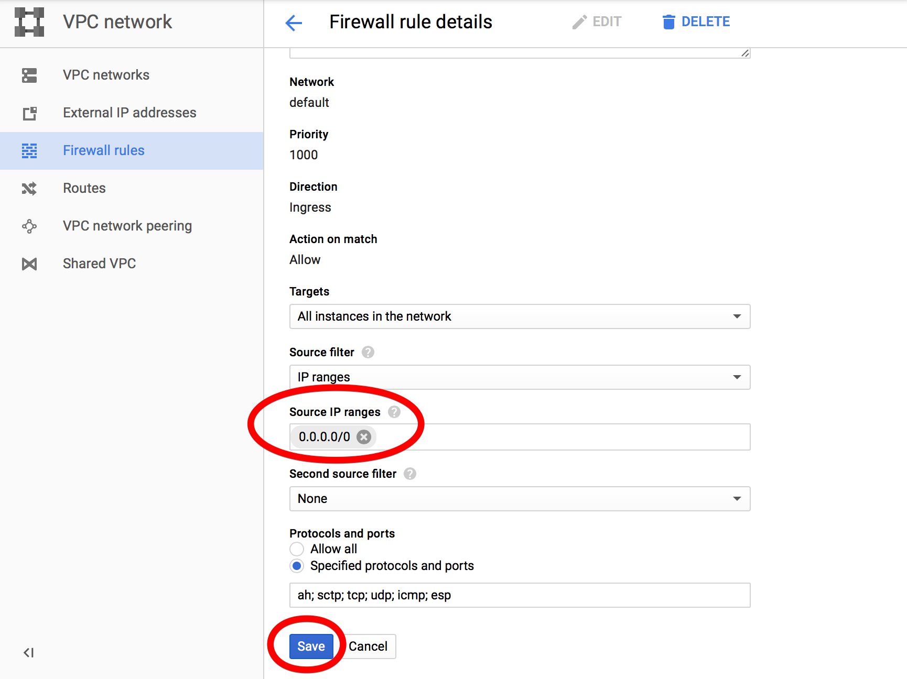

# Serverless backend

Do the following to deploy and use the backend:

1. Install kubeless following the instruction from the main [README.md](../../../README.md)
2. Install an Ingress Controller in case you still don't have one:
```
$ curl -sL https://raw.githubusercontent.com/kubeless/kubeless/master/manifests/ingress/ingress-controller-http-only.yaml | kubectl create -f - 
```
3. Deploy a MongoDB service. It will be used to store the state of our application:
```console
$ curl -sL https://raw.githubusercontent.com/bitnami/bitnami-docker-mongodb/master/kubernetes.yml | kubectl create -f -
```
4. Run `npm install` to install the used npm packages
5. Run `serverless deploy` to deploy the `todo` service in our kubernetes cluster
```console
$ serverless deploy
Serverless: Packaging service...
Serverless: Deploying function delete...
Serverless: Deploying function update...
Serverless: Deploying function read-one...
Serverless: Deploying function create...
Serverless: Deploying function read-all...
Serverless: Function delete successfully deployed
Serverless: Function read-all successfully deployed
Serverless: Function update successfully deployed
Serverless: Function create successfully deployed
Serverless: Function read-one successfully deployed
```

# Running the Backend in GKE

In case your cluster is running on GCE you need to perform an additional step. If you check the Ingress rules that has been created:
```
$ kubectl get ingress
NAME                    HOSTS                  ADDRESS         PORTS     AGE
ingress-1505835652059   35.185.47.240.nip.io   35.196.212.24   80        18s
```

There are two different possibilities, using `35.185.47.240.nip.io` or `35.196.212.24`. We will use the IP address (`35.196.212.24`) since it is accessible through HTTP. The hostname points to the Kubernetes API and it is only accessible through HTTPS and using the cluster certificate so it is not suitable for our application.

In any case we need to go to the [google console](https://console.cloud.google.com/) to enable HTTP traffic for the IP that we want to use.

On the left menu go to: `NETWORKING` -> `VPC Network` -> `Firewall rules` and select the Firewall rule that applies to all the Targets:



Then click on EDIT and modify the `Source IP ranges` to make it accessible from outside of the cluster and click on `Save`:



 | Note: This will make the cluster accessible from anywhere to any port. You can create a more specific rule to only allow TCP traffic to the port 80

You should now be able to access the functions:
```console
$ curl 35.196.212.24/read-all
[]
```

This IP is the one that should be used as `API_URL` in the frontend.
